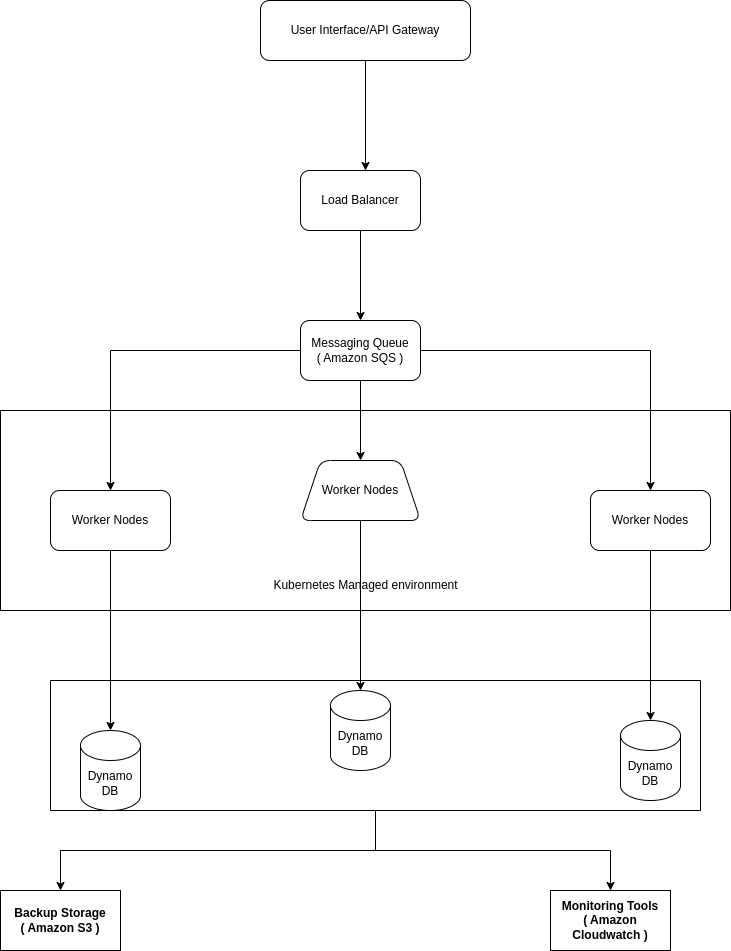

# System Design for URL Metadata Collection

## Overview
This document outlines the architecture and technologies used to design a scalable service for collecting and storing metadata from billions of URLs. The system is designed to maximize cost efficiency, performance, reliability, and scalability.

## Architecture Diagram
Here, you would insert a simple block diagram showing the main components of your system. Use a tool like Lucidchart, draw.io, or even simple ASCII art.

## Components

### Web Crawler
- **Description**: The crawler is responsible for fetching URLs and extracting metadata.
- **Technology**: Node.js with Axios for HTTP requests and Cheerio for HTML parsing.

### Message Queue
- **Description**: Manages the distribution of URL crawl tasks to various worker nodes.
- **Technology**: Amazon SQS (Simple Queue Service) for its scalability and ease of integration.

### Worker Nodes
- **Description**: Perform the actual task of fetching and processing URLs distributed by the message queue.
- **Implementation**: Docker containers orchestrated with Kubernetes to handle variations in load effectively.

### Data Storage
- **Description**: Stores the URL metadata efficiently for quick access and analysis.
- **Technology**:
  - **Primary Storage**: Amazon DynamoDB for its ability to handle large scale data with low latency.
  - **Backup/Long-term Storage**: Amazon S3 for cost-effective, durable storage of less frequently accessed data.

## Scalability
- **Horizontal Scaling**: Both the worker nodes and the database are designed to scale horizontally to handle increases in load.
- **Auto-scaling**: Utilize AWS Auto Scaling to dynamically adjust the number of active worker nodes based on the demand.

## Cost Optimization
- **Spot Instances**: Use EC2 Spot Instances for worker nodes to reduce costs.
- **Data Transfer Optimization**: Minimize data transfer costs by keeping traffic within the AWS network.

## Reliability
- **Data Redundancy**: Use Amazon S3's cross-region replication to ensure data durability and availability.
- **Error Handling**: Implement robust error handling in the crawler to manage and retry failed crawl attempts.

## Performance
- **Caching**: Implement caching using Amazon ElastiCache to reduce the load on the database during frequent access operations.
- **Batch Processing**: Use batch operations in DynamoDB to minimize the number of read/write operations.

## Security
- **Data Encryption**: Ensure that all data in transit and at rest is encrypted using AWS built-in encryption mechanisms.
- **Access Controls**: Use AWS Identity and Access Management (IAM) to restrict access to the infrastructure based on the principle of least privilege.

## Monitoring and Maintenance
- **Monitoring Tools**: Utilize AWS CloudWatch to monitor the health and performance of all components.
- **Logging**: Collect and analyze logs using Amazon CloudWatch Logs.

## Conclusion
This design provides a robust foundation for a scalable, reliable, and cost-effective system capable of handling billions of URLs and their associated metadata.

